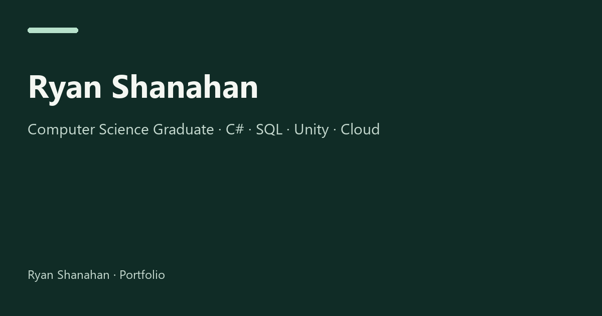

# Ryan Shanahan — Portfolio

A portfolio for graduate IT opportunities, presenting a published Android game, C# applications, and cloud/security coursework through concise project evidence.

[Live website](https://rshanportfolio.netlify.app/) · [GitHub profile](https://github.com/RyanShanahan-IT) · [CV (PDF)](documents/Ryan-Shanahan-CV.pdf)



## Run locally

The site has no build step or package dependencies. From the repository directory, with Python 3 installed:

```sh
python -m http.server 8000 --bind 127.0.0.1
```

Open `http://127.0.0.1:8000`. You can also open `index.html` directly, although browser storage behaviour can differ for local files.

## Structure

| Path | Purpose |
| --- | --- |
| `index.html` | Semantic page content, project evidence and native disclosures |
| `style.css` | Responsive layouts, shared colour tokens, light/dark and print styles |
| `script.js` | Optional theme persistence, disclosure deep links and footer year |
| `assets/` | Optimised WebP thumbnails, video posters, favicon and social card |
| `images/` | Original project images and demonstration recordings |
| `documents/` | Downloadable CV |
| `scripts/check_site.py` | Dependency-free local link, asset and markup checks |
| `.github/workflows/check.yml` | Static checks for pushes and pull requests |

## Design decisions

- Put selected projects before credentials so visitors can inspect the work quickly.
- Use native HTML anchors, `details` and video controls. Navigation and core content do not depend on JavaScript.
- Keep all text visible by default; there is no typewriter or scroll-reveal gate.
- Connect skills to project evidence rather than using proficiency percentages.
- Keep image originals available through keyboard-accessible links, while showing smaller WebP versions inline.
- Set video `preload="none"`, supply posters, and lazy-load images below the opening section. The existing MP4 files remain available; they have not been re-encoded.
- Use locally hosted DM Sans (SIL Open Font License) with system-font fallbacks. No external font service or icon library is required.
- Respect the system colour scheme until a visitor selects a theme. Storage failures do not prevent the control working for the current visit.
- Honour reduced-motion preferences and provide focus indicators and a skip link.

## Checks

Requires Python 3.9+ and Node.js for the JavaScript syntax check:

```sh
python scripts/check_site.py
node --check script.js
```

The Python check validates local file/anchor references, unique IDs, main/heading landmarks, viewport metadata, image dimensions and alt text, video controls/posters, URL separators and the CV file signature. These checks do not prove complete accessibility or validate external link availability.

Before a release, also inspect phone and desktop layouts in both themes, use the keyboard to navigate and open project details, reload to verify theme persistence, and try the CV, demo and image links. Review any changed project claims against their evidence.

## Content provenance and maintenance

The redesign preserves the project facts from the previous portfolio. No user counts, performance measurements, credential dates or additional qualifications were invented. Azure deployment and AWS coursework are described separately. Security mitigation notes are general discussion, not claims of controls implemented in the lab.

The PDF is an unchanged export of the CV already linked by the original site, retrieved on 15 September 2026. Replace `documents/Ryan-Shanahan-CV.pdf` when the CV changes; the original document is [here](https://docs.google.com/document/d/104jyGMTfOEU4qVk1ykIEHFwoCXzsNwvo/edit).

Repository checks on 15 September 2026 found:

- `BakeryScramble` contains a project README, so its link is labelled as a project overview.
- `DBS_Bank04` contains a ZIP archive, so its link is labelled as an archive.
- `2D-Unity-Boardgame` is empty; the existing Drive project download is retained instead.
- Library, hospital and cloud materials remain linked to their existing documents/downloads.

See [content follow-ups](docs/content-follow-ups.md) for additions that require further source material.

## Hosting

The existing Netlify site serves the repository root as static files. No new hosting configuration is needed. Review branch changes before merging into the production branch.

## Code style

Use two-space indentation, descriptive names and small functions. Keep HTML sections expanded so their structure is easy to follow. Add comments for decisions that need explaining.

Format HTML, CSS and JavaScript with the checked-in Prettier settings:

```sh
npm exec --yes --package=prettier@3.6.2 -- prettier --write index.html style.css script.js
```

The font and its licence are in `assets/fonts/`.
